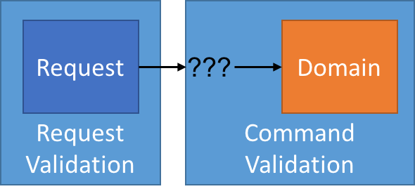

# 领域命令模式 —— 验证

通常，我构建的应用程序都遵循 CQRS，它促使我分隔我的应用程序架构为命令和查询。然而，没有两个应用程序是按照他们应用的 CQRS 完全相同的。这里总会有一些不同。

我应用程序也会为了外部 "请求" 有显式对象，它是绑定到 HTTP 请求变量类型。可能会是 POST，或是 JSON POST，但是无论如何，它们都是请求对象。

真正的请求是 —— 请求对象最终如何影响到我的领域对象？


在我进入不同模式之前，我喜欢确保我理解我将要解决的问题。在上面图片中，从外部请求上来看，我需要了解一些问题：

- 我请求的对象是被接受还是拒绝？
- 如果拒绝了，原因是什么？
- 如果接受了，会发生什么？

在正式情况，它们不是一触发就丢掉的请求，你需要的是某种认可。在我考虑这些选项时我要将这些记在我心里。

## 验证类型

首先考虑验证。我倾向于至少结合两个不同级别验证：

- 请求验证
- 领域验证

考虑请求验证，像 "我填对了表格了么"。这是很容易转换到客户端验证规则。如果在 100 年前，这将是一个接待员确保你已经填好了但所有该填的盒子。这种验证你能立马返回给客户端和不需要知道全领域对象相关的知识。

下一级验证就是领域验证，或者像我经常看到的那样，"业务规则验证"。这种更倾向于系统状态验证，"我能引起变化到我的系统吗？，基于我系统目前的状态"。我可能检查单个实体的状态，一组实体，实体集合中的某个实体，或者是整个系统。这里，关键是我不会检查请求本身，而是针对系统状态。

当你把请求的验证和领域验证混合到一起时，它就不纯粹了。验证框架是不会缓和这两者的，并且是经常建议反对为领域实体使用验证框架。在过去我就这么做过，并且结果...并不是很好。

> 作为附注，我尽可能的避免关于系统状态改变任何验证然后进行验证的验证。我的验证应该我企图去改变的地方，而不是之后。也就是说在实体上没有验证标签，例如。



接着，我需要关注我自己去验证错误是怎么冒出来的。对于请求验证，这是非常简单的。我能马上返回 `400 Bad Request` 以及一个描述了这个请求错误的准确信息体。特别是，请求验证发生在应用程序的 UI 层 —— 我使用的是 MVC 框架内置的。请求验证不能影响我领域验证的设计。

## 领域验证

现在，我已经把我关注的验证分开成请求验证和领域验证，我必须决定我要想要在领域端如何验证，以及我如何把信息往上抛。要记住 —— 这是非常重要的，不仅要了解请求失败，还要知道为什么失败。

在领域端，理解为什么这么设计是很重要的。对于失败，我能有一个或是多个理由么？这个理由需要包含上下文数据么？我必须关联一个失败的原因到指定的输入么？或者是在理由中只需要上下文数据就够了？

下一步，失败要面临什么？当到领域的请求（或命令）通过的时候，它如何告诉我这个命令是无效的？它只是返回一个失败回去么？或者是用一些见解的提示，像一个异常？

```c#
public void DoSomething(SomthingRequest request) {
    if(stateInvalid) {
        throw new DomainValidationException(reason);
    }
    entity.DoSomthing();
}
```

或者

```c#
public bool DoSomthing(SomethingRequest request) {
	if(stateInvali) {
		return false;
	}
	entity.DoSomething();
	return true;
}
```

无论任何情况...

translate from https://jimmybogard.com/domain-command-patterns-validation/