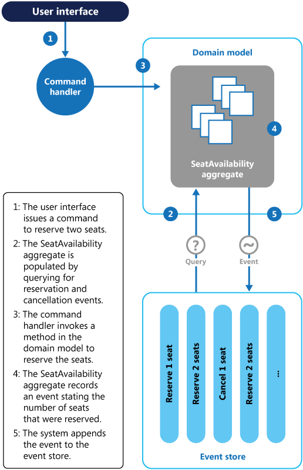

# 事件溯源模式

使用一个仅追加的存储来记录一系列完整的事件，这些事件描述了在领域中数据的行为，而不是仅仅存储当前状态，以便于用存储来实现领域对象。这个模式能简化任务，在复杂的领域通过避免同步数据模型和业务模型的要求；提高性能，伸缩性以及响应能力；提供事务数据一致性； 维护完整的审计跟踪和历史记录，以支持补偿措施。

## 问题上下文

大多数应用程序都会使用数据，典型的方法就是用户使用数据时，通过维护数据的当前状态来更新它。举个例子，

在传统的创建，读取，更新以及删除（CRUD）模型，一个数据将会从存储中读取出来处理，然后做一些修改，并且更新这个数据的状态 —— 这种操作经常用事务锁住数据。

CRUD 方法有一些限制：

- CRUD 系统实际上在执行更新操作时会直接操作数据存储可能会对性能和响应能力有影响，并且还有伸缩性的限制，在处理高并发的请求时。
- 在领域之间协作中，会有很多并发用户，在对单个数据进行更新操作的地方，数据更新会很容易发生冲突。
- 除非你添加了审计机制，记录了没一个但操作的详细记录，否则这些操作日志和记录都会丢失。

## 解决方案

事件溯源模式定义了一个方法通过一系列的事件来处理数据操作，每个事件记录都是追加存储的。应用程序代码发送一些事件，这些事件描述了数据上发生的每个操作并持久化。每个事件都代表一组数据的改变（例如 AddedItemToOrder）。

事件作为源的原始记录存储在存储区，或关于系统数据当前状态的记录（给定一段数据元素或信息的数据源来验证）。事件存储区会指定发布这些事件，以便按需通知消费者处理它们。消费者可以这么做，例如初始化一个任务，在事件中提供一个操作到其他系统，或执行所有相关的动作并完成它。注意，应用程序代码生成事件要从事件订阅系统解耦。

事件发布的典型用法在应用程序中是通过事件存储区来维护一个实体的物化视图来改变它的行为，并且集成到内部系统中。例如，一个系统可能会维护一个所有客户订单的物化视图，作为 UI 的一部分填充。当应用程序添加新的订单时，在订单上添加或删除一项，以及添加新的运输信息，这个事件就会描述这些变化并更改这个物化视图。

> 关于物化视图模式请移步 [Materialized View pattern](https://docs.microsoft.com/en-us/previous-versions/msp-n-p/dn589782%28v%3dpandp.10%29)

另外，在任何时候应用程序都能读取事件事件历史并使用它来物化实体的当前状态，通过有效的 “重播” 和恢复所有的相关联的事件到实体。这可能发生在物化一个领域对像，当处理一个请求或通过任务调度时候，以便于实体状态能够作为物化视图来支持显示层，这可能会根据需求发生。

图 1 显示了这个模式大概逻辑，包括一些可选事件流，如创建新的物化视图，集成事件到应用程序和系统，并且指定实体状态下重播事件来创建项目。

​														图 1 - 事件溯源模式概述和例子

事件溯源模式提供很多优势，包括以下几点：

- 事件是不变的，并且能够以追加形式被存储下来。用户接口，工作流，或是发起产生事件继续进行的行为的过程，并且在后台处理事件的任务。这样与事务运行期间是不存在争用的事实相结合，能显著提高性能以及应用程序的伸缩性，特别是展现层或用户接口。
- 事件是一个简单对象，它仅描述一些发生的行为，与相关的数据一起来表述这个行为。事件不能直接更改数据存储；它们只是在合适的时间做简单的记录。这些因素可以简化实现和管理。
- 事件一般对领域专家有意义，但是复杂的对象关系匹配阻止了理解意思，这对于领域专家来说数据库表可能不会很清晰的理解。表是表示当前系统状态的 人工构造出来的，而不是事件所发生的。
- 事件源能帮助我们预防并发更新导致的冲突，因为它避免了直接在数据存储区更新对象。然而，从可能会有导致不一致状态结果的请求，领域模型必须被设计成受保护自己的。
- 只追加的事件存储区提供了一个审计追踪，它可以用来检测已经在发生在数据存储的行为，重新生成当前状态作为物化视图或通过任何时候重播事件来推测，以及协助测试和调试系统。另外，提供已经颠倒的改变历史，要求使用补偿事件来取消更改，如果模型只是简单的存储当前状态，则不会是这种情况。这些事件列表也能用来分析应用程序性能和保护用户趋势行为，或者获得其他有用的业务信息。
- 事件从通过事件存储触发了每一个事件执行行为的任务中解耦，这提供了伸缩性和可拓展能力。例如，有一个通过事件存储区触发的处理事件的任务，只知道事件和它包含的数据。这个任务从触发的事件操作中被解耦出来执行。另外，多任务能处理所有事件，这样可能能够简化集成其他服务和系统，它只需要监听事件存储区触发的新的事件。但是，事件源事件往往级别很低，并且它可能很有必要生成特殊的集成事件来代替。

> 事件源一般跟 CQRS 模式结合，在响应事件中，执行数据管理任务，并且从事件存储区中物化视图。

## 问题及思考

当决定实现这个模式的时候要考虑以下几点：

- 系统是最终一致性，当生成物化视图或通过重播事件来生成预测的数据。在应用程序添加事件到事件存储区作为结果来处理请求是有延迟的，事件一旦被发布，事件消费者就会处理它们。在此期间，新的关于实体更新事件可能会到达事件存储区。

  > 关于最终一致性的信息查看 [Data Consistency Primer](https://docs.microsoft.com/en-us/previous-versions/msp-n-p/dn589800%28v%3dpandp.10%29)

- 事件存储区是作为信息源不可变的，所以事件数据永远不会被修改。只有一个方式更新实体来取消更新，那就是添加一个补偿事件到事件存储区，就像在会计交易中使用负数一样。如果持久化的事件格式（不是数据）需要改变，也许是在迁移期间，它很难将已经在事件存储区存在的事件和新的版本结合。它可能很有必要迭代所有的事件来使满足新格式，或是使用新的格式添加到事件存储区。考虑在每个事件方案中使用版本搓来维护新老事件格式。

- 多线程应用程序和多实例应用程序也可能存储事件到存储区。事件存储的一致性尤为重要，按事件的顺序影响指定的实体（顺序影响改变实体的当前状态）。添加时间戳到每个事件是一种选择，它能避免这些问题。另一个通用的做法是给每个请求的结果事件使用增量标识符。如果两个行为企图在相同时间给相同实体添加了事件，事件存储区能杜绝匹配已存在的实体标识符和事件标识符。

- 对于读取事件来获取更多信息，没有标准的方法，也没有像 SQL 查询那样已经构建好的机制。唯一的数据就是使用事件标识符作为事件流提取。事件 ID 指定映射的具体实体。实体的当前状态只有在该实体的原始状态相关的事件重播下才会被决定。

- 每个事件流的长度会对系统的管理和更新有影响。如果流过大，就要考虑在在特定的时间间隔（比如特定的数量的事件）创建快照。当前实体状态可以从快照中获取，也可以从所有事件发生之后的那个时间点重播获取。

  > 关于创建数据快照相关更多信息，详见马丁的企业级应用程序架构站点的[快照](http://martinfowler.com/eaadev/snapshot.html)以及 MSDN 上的 [Master-Subordinate Snapshot Replication](https://docs.microsoft.com/en-us/previous-versions/msp-n-p/ff650012%28v%3dpandp.10%29)

- 尽管事件溯源最小化了数据更新的冲突的发生，但是应用程序还是要能够处理好最终一致性和缺少事务而可能出现的不一致性。例如，一个表明减少库存的事件可能到达数据存储区，而订单正被下单，其结果就要求这两个操作要协调；也许建议客户或者创建一个备份订单。

- 事件发布也许会 “至少一次”，所以消费者事件必须是幂等的。他们不能在修改事件中重复应答，如果这个事件已经被处理过了。举个例子，如果一个消费者的多实例维护实体的属性聚合，如下单的总数，在增长的聚合中只能成功一个，当 “下单” 事件发生的时候。这不是事件源的固有特征，这是通常的实现方法。

## 何时使用这个模式

这个模式适合于以下场景：

- 当你要捕捉数据的 “趋势”，“目的”，或是 “理由”时。例如，改变客户实体会被作为一系列特定事件类型捕捉（如搬家，已结账，或已故）。
- 当最小化或完成避免数据并发更新冲突时是尤其重要的
- 当你想要记录事件发生，以及能够重播他们来还原系统当时的状态；使用它们回滚系统的改变；或者简单的历史记录和审计日志。举个例子，当一个任务涉及到多个步骤，你需要执行这些步骤来恢复更新然后重播这些步骤来把数据恢复来达到一致的状态。
- 使用事件在应用程序中是普通的操作，并且不需要附加开发或实现工作。
- 当你需要将输入处理或更新数据的过程从应用这些操作所需的任务中解耦。这会提高 UI 性能，或是分布事件到其他监听者如其他应用程序或服务，他们必须当事件发生的时候执行这些操作。一个例子是，将工资单系统与费用提交网站集成，以便在费用提交网站通过网站和工资系统被消费来响应数据更新的事件存储来触发事件。
- 如果需求改变，你想要灵活的要能够改变物化模型的格式以及实体数据改变的时候，或当在于 CQRS 结合一起使用 —— 你需要接受读取模型或者暴露数据的视图。
- 当结合 CQRS 一起使用，当模型被更新时读取模型时，要接受最终一致性，或者你也可以水化（rehydrating）实体以及能够接受来自数据流的数据所产生的性能影响是可以接受的。

事件溯源模式不适合以下场景：

- 小且简单的领域，系统没有太多业务逻辑，或没有领域系统通过传统的 CRUD 也能工作得很好的管理机制系统
- 系统要求数据一致性和实时更新
- 审计追踪以及回滚能力以及重播都不是必须的系统
- 很少有并发带来的更新冲突的系统。例如，主要都是增加数据而不是更新数据。

## 例子

会议管理系统需要跟踪会议已完成预定的数量，以便于检查是否还有座位能够继续预定。系统至少有两种方式来存储会议预定：

- 系统存储有关预定总数的信息作为单独的实体存储在保存预订信息的数据库中。预定能够产生也能取消，所以系统要增加和减少其相应的数量。这个方法理论非常简单，但是如果在短时间内有大量的预定动作会引起可拓展方面的问题。例如，在预定期结束前最后一天左右。
- 系统存储有关预定和取消作为事件存储至事件存储区。它能通过重播这些事件来计算出能用的座位。这个方法由于事件的不变性更加具有灵活性。系统只需要从事件存储区中读取数据，或者追加数据到事件存储区。预定和取消的事件信息一旦发生就不会变。

图 2 显示了如何使用事件溯源实现会议管理系统的座位预定子系统。

​									图 2 - 使用事件源来捕捉会议管理系统中关于预定座位的信息

预定两个座位的行为依次如下：

1. 用户接口发起命令预定两个座位。这个命令是由单独的命令程序处理的（这段逻辑解耦了用户接口和响应这个命令请求处理程序）。

2. 聚合包含关于所有预定相关的信息，查询事件描述了预定和取消。这个聚合被称为 **SeatAvailability**，并且还包含了领域模型，它开放查询和修改数据的方法。

   > 考虑使用快照优化（你可以无需查询和重播所有的事件来获取聚合的当前状态），以及维护一个缓存，它拷贝了聚合的副本在内存中。

3. 命令处理程序调用了领域模型开放的这个方法来预定。

4. **SeatAvailability** 聚合记录了事件，事件包含了已经预定的座位数。下次聚合会应用这个事件，所有的预定事件都将被用来计算到底还有多少个座位。

5. 系统追加新的事件到事件存储区中

如果用户希望取消座位，系统会按照上面相似的预期的命令处理命令处理程序，它会生成一个取消事件并追加到事件存储区中。

只要为灵活性提供更多的空间，使用事件存储区也能为关于会议的预定和取消提供完成历史记录，或审计追踪。在事件存储区中的事件记录了源的真相。这里不需要以其他方式持久化聚合，因为系统能很容易的从重播事件以及在那个时间点还原状态。

[Event Sourcing Pattern]: https://docs.microsoft.com/en-us/previous-versions/msp-n-p/dn589792(v=pandp.10)?redirectedfrom=MSDN	"事件溯源模式"

